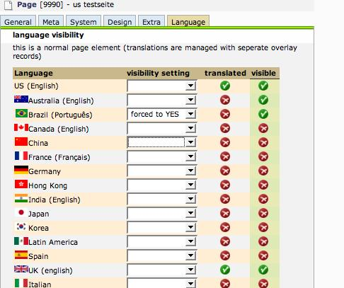
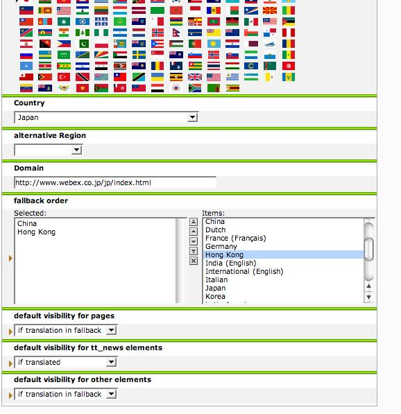



.. ==================================================
.. FOR YOUR INFORMATION
.. --------------------------------------------------
.. -*- coding: utf-8 -*- with BOM.

.. ==================================================
.. DEFINE SOME TEXTROLES
.. --------------------------------------------------
.. role::   underline
.. role::   typoscript(code)
.. role::   ts(typoscript)
   :class:  typoscript
.. role::   php(code)

Introduction
------------

What does it do?
^^^^^^^^^^^^^^^^

This extension changes the languagehandling in TYPO3 to fit enterprise
needs (a more flexible - One Tree concept):

- Multilanguage Fallbacks

- Individual per language configuration of the behaviour

- Languagevisibility concept for pages, content, news that enables:

  - Hide or Show several elements only in desired language

  - Create new elements even by pure translators

- Introduce new FCE localisationmode (translation of FCE with overlay
  records)

Screenshots
^^^^^^^^^^^

